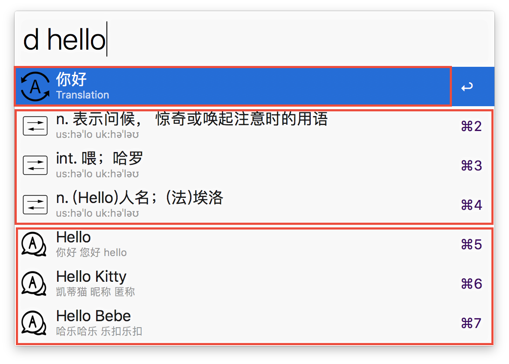
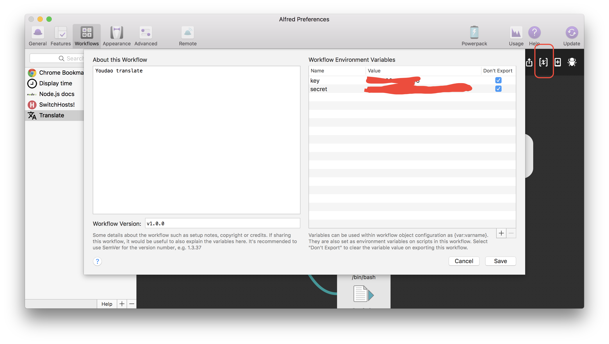

# alfred-workflow

放我自己写的workflow的

## time - 显示时间

> menu bar 我不显示完整的时间，所以有时候想看下时间，又不想点鼠标，这个就用得上了。简单了点。慢慢改。

## translate

> 其实这个translate网上已经有很多了，我之前还不会写workflow的时候，也是用网上的。
但还是自己写，能按自己的需求，这个比较舒服点，还有一方面，就是练手啊。
之前用过一个github同学的。功能比较全。还可以同步youdao单词本。
但是就是不知道为啥，那个python一启动，我的风扇就呼呼转。
还有一点了，我找youdao 翻译 api的时候，发现没有以前那个免费的了。以前都是作者开发。大家共用一个key。然后有时候就不行了。
现在有道搞了这个东西出来[有道智云](http://ai.youdao.com/)，是按量收费的。我开发的时候，调试，花了1毛多。也不知道贵还是不贵。
但是要用呢。现在新注册账号系统送100元。先用着吧。workflow里面也配置好了。导入的时候。记得配置自己的appkey和secret呢。
这个在有道智云自己搞下就行了。

### 目前的功能

* 自动中英
* 复制
* 光标下自动插入翻译文本
* 网页打开
* 系统发音

### 效果是这样子的

> 这个翻译分了3个部分，第一个框的，是api返回的translation, 应该是翻译比较准的吧
第二个就是音标了。只英中的时候才有呢，不一定有
第三个就是网络释义了，好像是这么样子的，不一定有

* ctrl + enter = 有道网页打开
* shift + enter = 光标写入
* cmd + enter = 系统发音
* enter = copy

### 最后一步了

> 导入workflow的时候，记得在下面输入你的appkey和secret，这样就可以好好玩了。记得export那个小框框选上呢。这样你导出的时候，密钥就不会给导出了。

